# 🍽️ Meals App 2

An enhanced version of "Meals". A Flutter application that lets users explore a variety of meals categorized by cuisine and filtered by dietary preferences. Users can also favorite meals they love!

---

## ✨ Features

- 🔍 **Meal Categories**  
  Browse meals by different cuisines such as:
    - Asian
    - French
    - Italian
    - Hamburgers
    - Exotic
    - ...and more!

- 🥦 **Dietary Filters**  
  Filter meals based on your dietary needs:
    - Gluten-free
    - Lactose-free
    - Vegetarian
    - Vegan

- ❤️ **Favorites**  
  Mark meals as favorites and easily access them anytime.

---

## 🛠️ Tech Stack

- [Flutter](https://flutter.dev/)
- Dart
- State management

---

## 📦 Platforms Supported

- 🕹️ Web (HTML5)
- 💻 Windows
- 📱 Android

---

## 📸 Screenshots

> Screenshots from each platform

### 🖥️ Windows

| Home                                                  | Category                                                      | Filters                                                     | Favorites                                                       | Meal                                                            |
|-------------------------------------------------------|---------------------------------------------------------------|-------------------------------------------------------------|-----------------------------------------------------------------|-----------------------------------------------------------------|
| 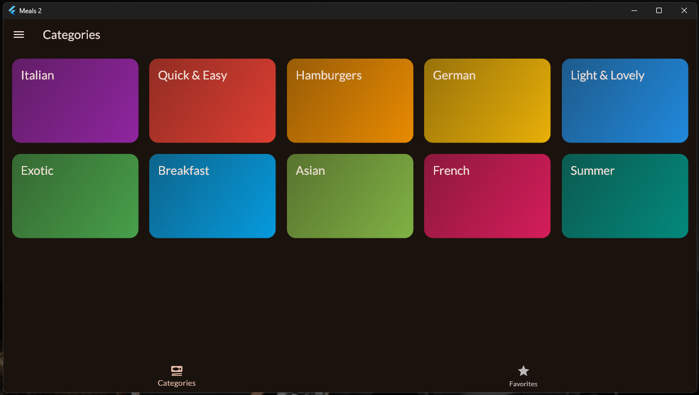 | 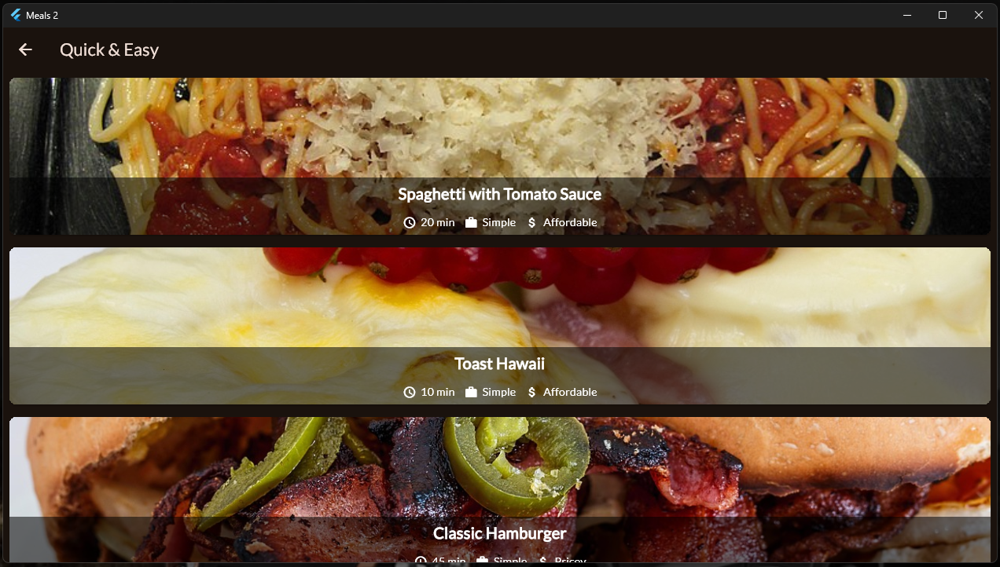 | 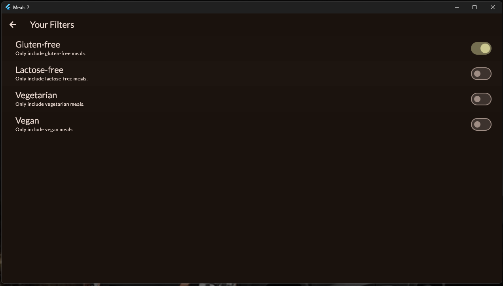 | 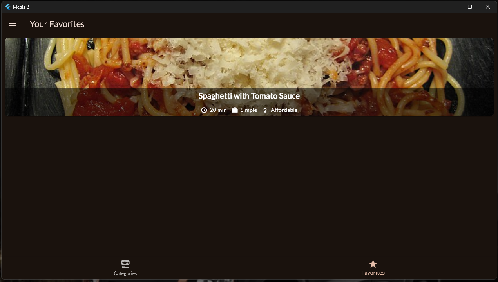 |  |

### 🌐 Web

| Home                                      | Category                                          | Filters                                         | Favorites                                           | Meal                                                |
|-------------------------------------------|---------------------------------------------------|-------------------------------------------------|-----------------------------------------------------|-----------------------------------------------------|
| 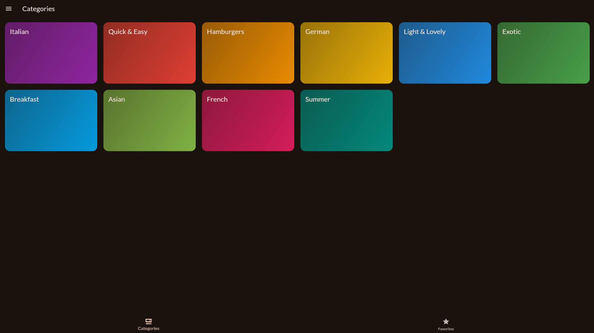 | 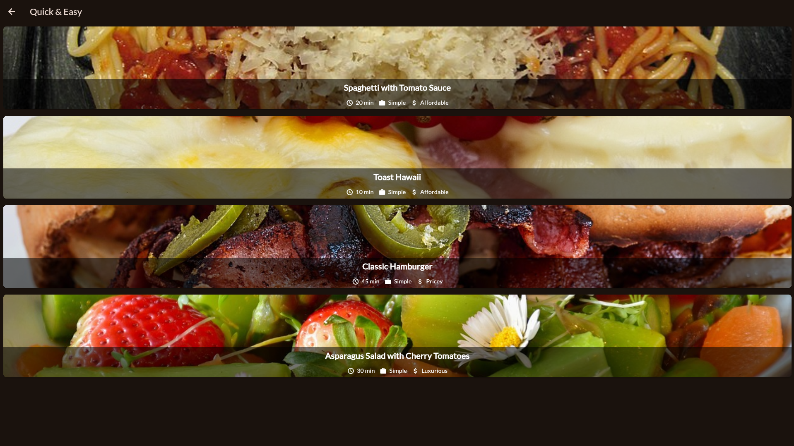 | 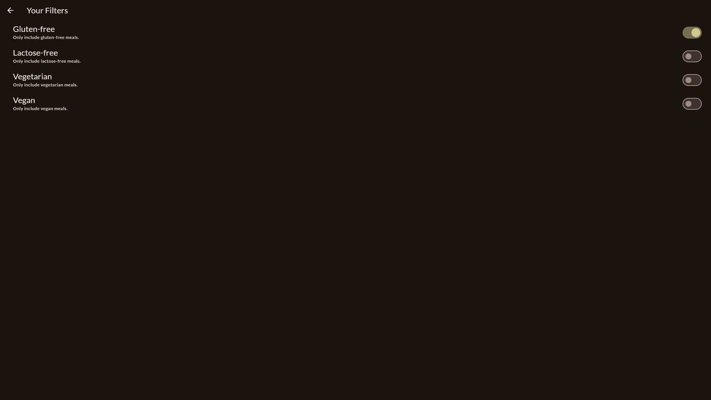 | 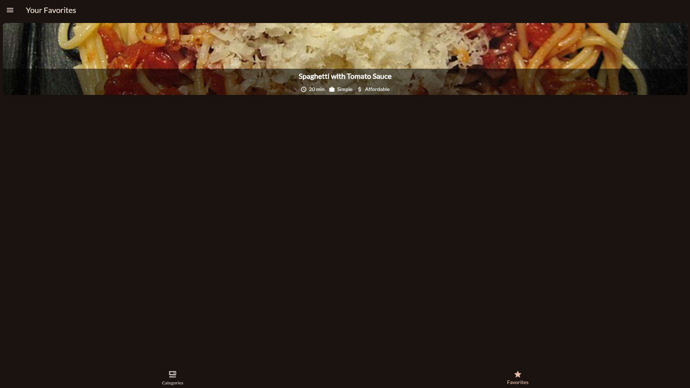 | 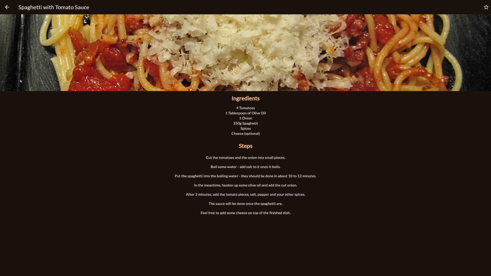 |

### 📱 Android

| Home                                                                      | Category                                                                          | Filters                                                                         | Favorites                                                                           | Meal                                                                                |
|---------------------------------------------------------------------------|-----------------------------------------------------------------------------------|---------------------------------------------------------------------------------|-------------------------------------------------------------------------------------|-------------------------------------------------------------------------------------|
| 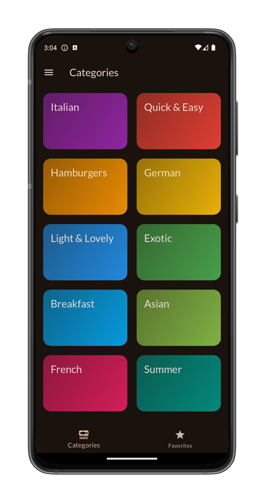   | 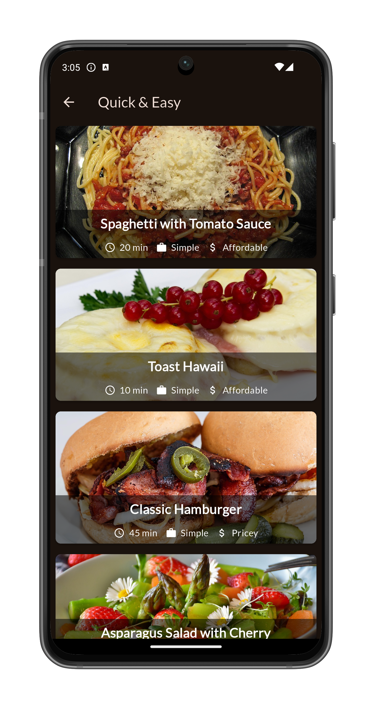   | 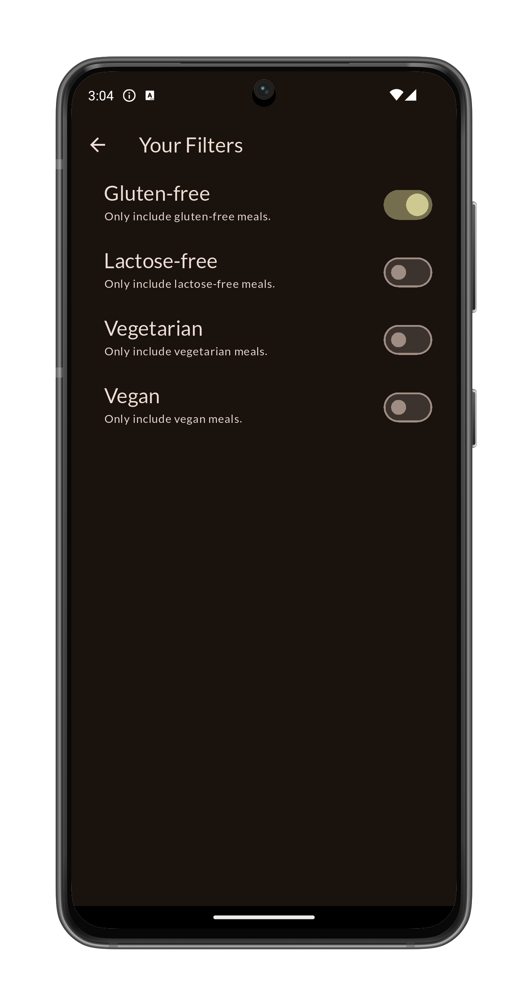   |    | 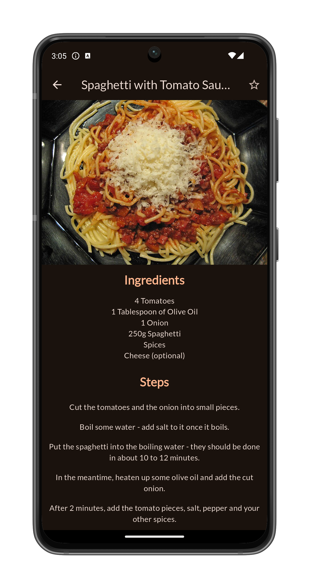   |
| 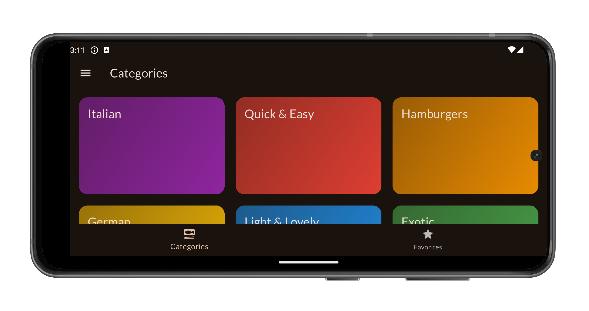 | 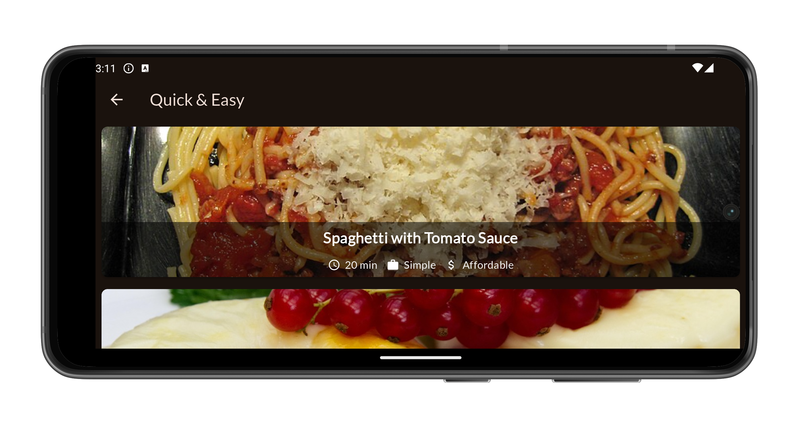 | 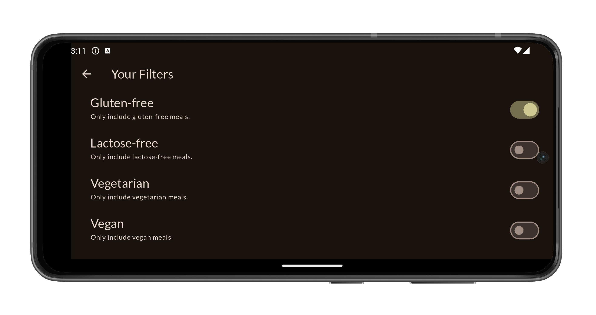 | 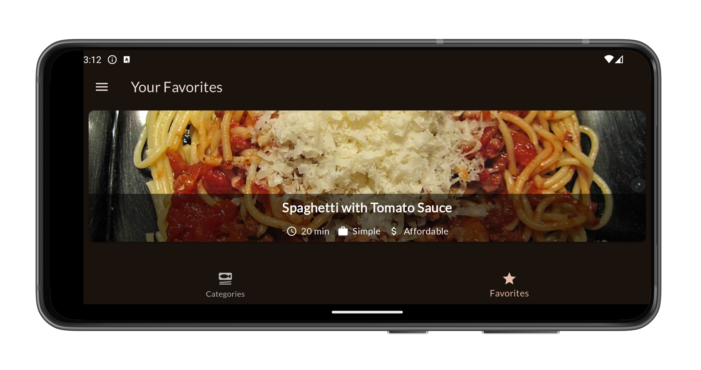 | 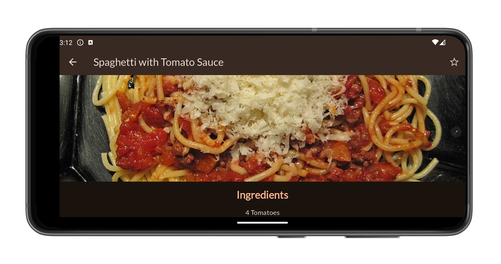 |

---

## 🌐 Live Demo

- 🔗 **Web (GitHub Pages):**  
  [Demo](https://omnitechphilippines.github.io/meals2/)

---

## 📦 Download Releases

- 💻 **Windows (.7z):**  
  [Download for Windows {{VERSION}}](https://github.com/omnitechphilippines/meals2/releases/download/{{ENCODED_VERSION}}/windows-release-{{ENCODED_VERSION}}.7z)

- 📱 **Android (.apk):**  
  [Download for Android {{VERSION}}](https://github.com/omnitechphilippines/meals2/releases/download/{{ENCODED_VERSION}}/app-release-{{ENCODED_VERSION}}.apk)

- 🌐 **Web build (.7z):**  
  [Download Web Build {{VERSION}}](https://github.com/omnitechphilippines/meals2/releases/download/{{ENCODED_VERSION}}/web-release-{{ENCODED_VERSION}}.7z)

> You can also find all versions in the [Releases Page](https://github.com/omnitechphilippines/meals2/releases)

---

## 🚀 Getting Started

### Prerequisites

- Flutter SDK `v3.29.0`
- Dart SDK `v3.7.0`

### Run the app

```bash
# Clone the repo
git clone https://github.com/omnitechphilippines/meals2.git
cd meals2

# Get packages
flutter pub get

# Run the game (Web)
flutter run -d chrome

# Run the game (Windows)
flutter config --enable-windows-desktop
flutter run -d windows

# Run the game (Android)
flutter run -d android
